# Hands-On Guide: Integrating ABAP with SAP Build

## Table of Contents

1. [Introduction](#introduction)
2. [Prerequisites](#prerequisites)
3. [Environment Setup](#environment-setup)
4. [Hands-On Exercises](#hands-on-exercises)
5. [Key Takeaways](#key-takeaways)
6. [Troubleshooting](#troubleshooting)
7. [Appendix](#appendix)

## Introduction

Welcome to this hands-on session on integrating ABAP with SAP Build. This guide will walk you through step-by-step instructions to understand and implement the integration effectively.

**Objectives:**

- Understand the role of SAP Build in ABAP development.
- Set up the environment for integration.
- Create and extend ABAP packages via SAP Build.

## Prerequisites

**Knowledge Requirements:** Familiarity with SAP Build, ABAP, and SAP BTP.

**Access Requirements:** Ensure access to the following:

- SAP BTP Account with necessary entitlements.
- SAP Build subscription.
- ABAP system (BTP or S/4HANA Public Cloud).

**Tools:**

- [Eclipse](https://www.eclipse.org/downloads/packages/release/2024-12/m3) with ADT installed ([Download ADT](https://tools.hana.ondemand.com/latest)). Additional help guide [here](./ADTSetup.md).
- Updated browser supporting SAP Build UI.

## Environment Setup

**SAP Build system with access to Build Code, Build Apps and Build Process Automation is already available:** [Link](https://spa-us10-nwjsondh.us10.build.cloud.sap)

## Hands-On Exercises

**Note:** The system is for testing purposes only. After the session, all data will be lost, so keep that in mind when creating new TRs or objects.

### Exercise 1: Creating an ABAP Project in SAP Build

1. **Access the SAP Build Lobby:**

   Log in to the [SAP Build Lobby](https://spa-us10-nwjsondh.us10.build.cloud.sap) and click `Create` > `Build an Application` > `ABAP Cloud`.

   

   

   

2. **Select System:**

   From the System dropdown, select **BD2**, which is the mapped system for the session. This system has been pre-configured for the session.

3. **Package Selection:**

   You can create a new package under **ZSAP_BUILD_DAY** as super packages. Ensure that the new package name starts with **Z**.

   **Working with a New Package:**

   i. Create a new Package by providing the super package name, package name and description.

   

   ii. Configuring Transport Requests:

   a. Use Existing Transport Request: Select an existing transport request (TR) from the dropdown.

   b. Or Create a New Transport Request: create a new transport request by entering a description.

   

4. **Proceed to ABAP Project Creation:**

   

5. **Post successful creation open the project in Eclipse.**

   i. Allow browser to open eclipse.

   

   ii. Create a new project from the link.

   

   iii. Click on Next.

   

   iv. Logon using test user through browser and close the new tab once done.

   

   

   v. Finish with the creation

   

6. **Copy the template content into your package.**
   i. Close the RAP Wizard.

   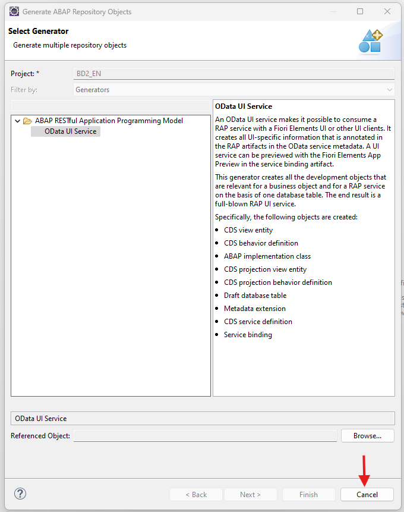

   ii. You will see your newly created package.

   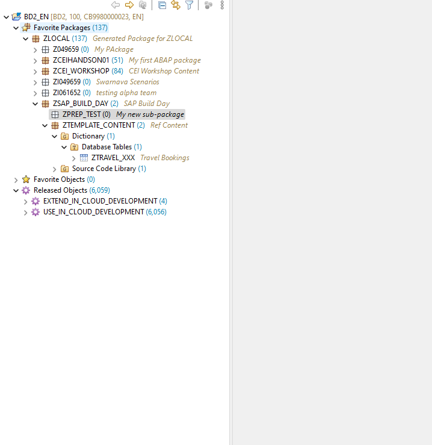

   iii. Expand the package **ZTEMPLATE_CONTENT** and copy the database table `ZTRAVEL_XXX` into your package. Remember to replace the `XXX` with a number assigned to your user to avoid conflicts.

   

   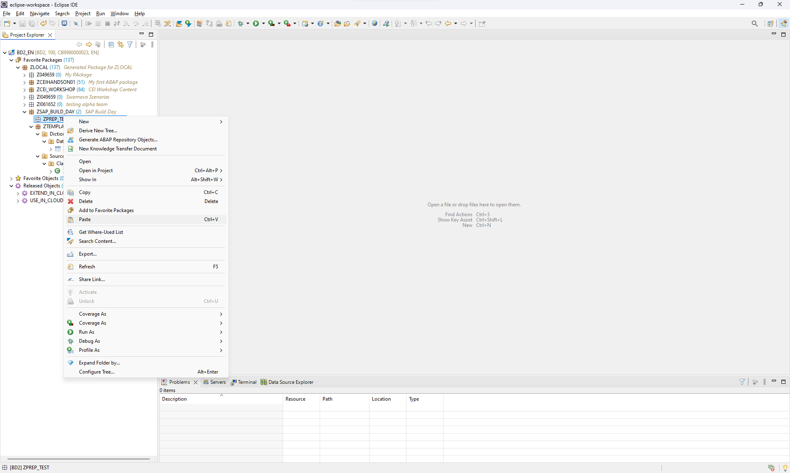

   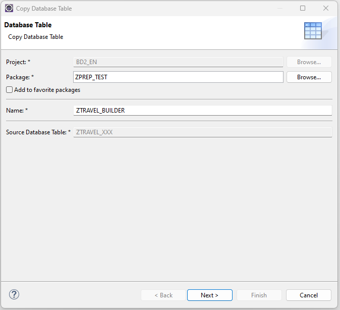

   

   iv. Activate your newly created database table.

   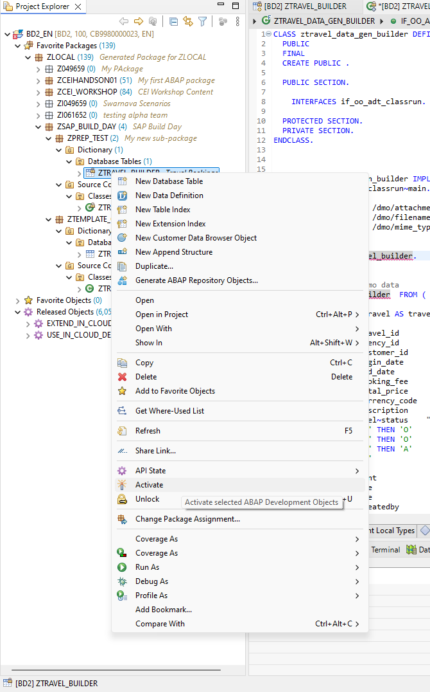

   v. Now copy the data generator class `ZTRAVEL_DATA_GEN_XXX` into your package. Remember to replace the `XXX` with a number assigned to your user to avoid conflicts.

   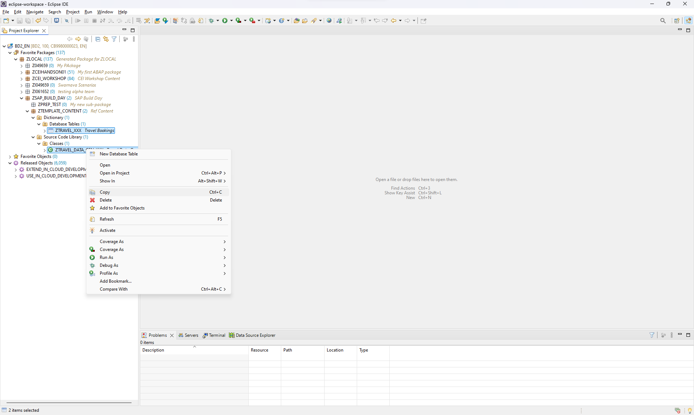

   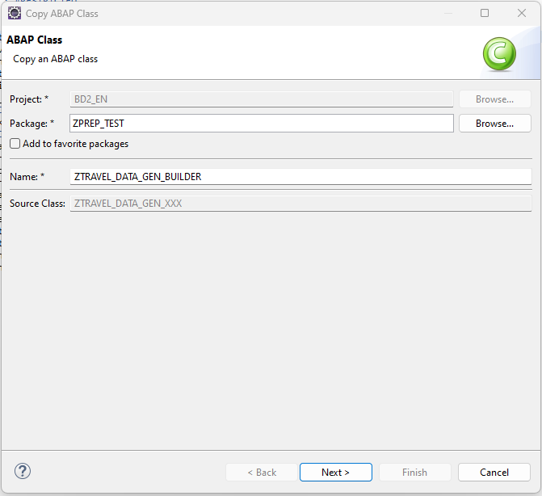

   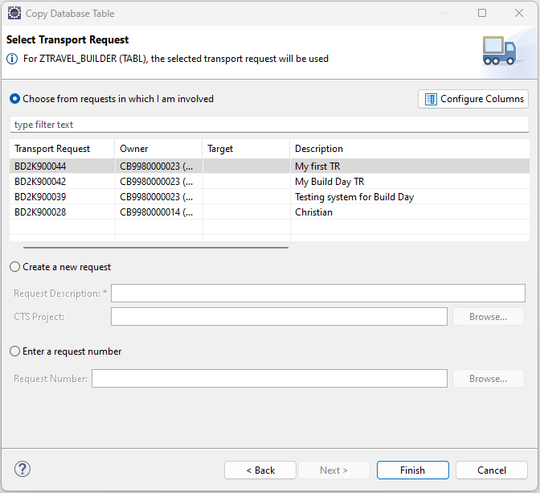

   vi. Update the table name in the newly copied data generator class to point to the table you have created.

   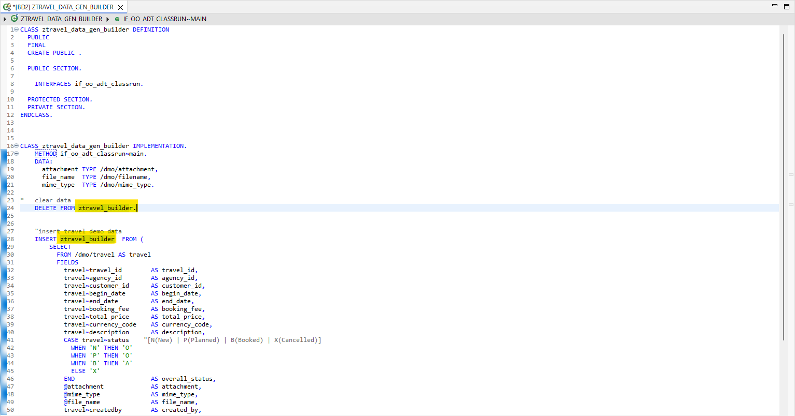

### Exercise 2: Generating and Using Service Bindings

1. **Create a New ABAP Object:** Use the Repository Object Generator Wizard to create a new OData UI service for your ABAP object.

   i. Select your new table and right click. Select `Generate ABAP Repository Objects` to open the RAP Wizard. Then select `ODATA UI Service`.

   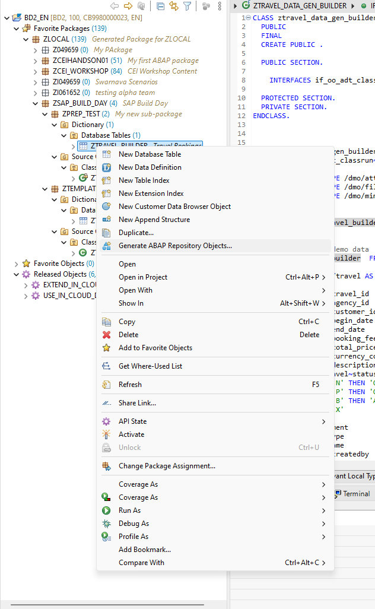

   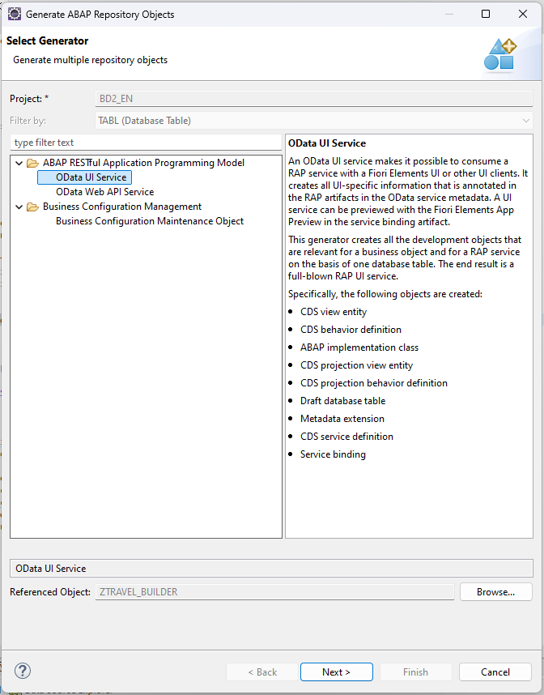

   ii. Search for your package and then chose the object accordingly and press Next.

   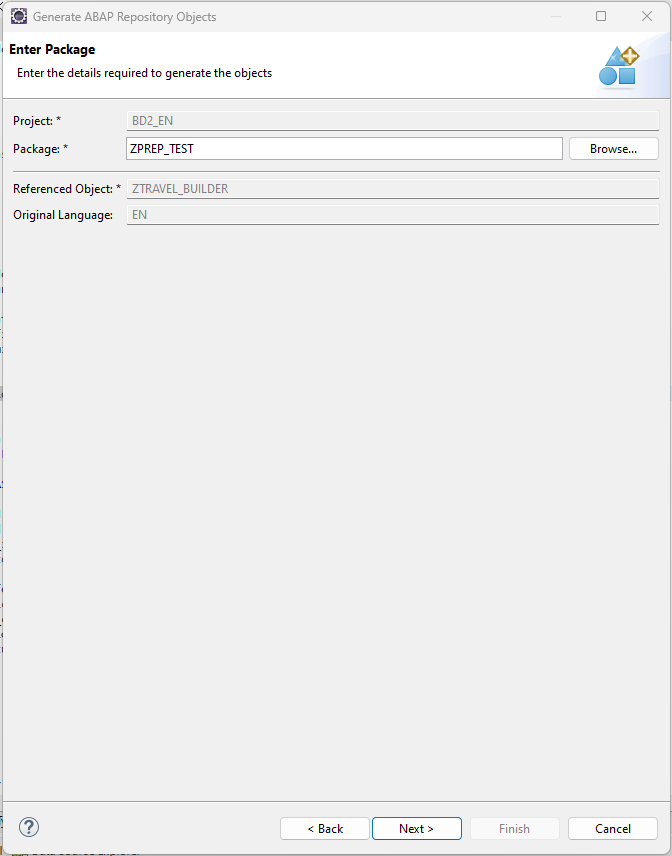

   iii. Press Next.

   

   iv. Review the list of repository objects that are going to be generated and press Next again.

   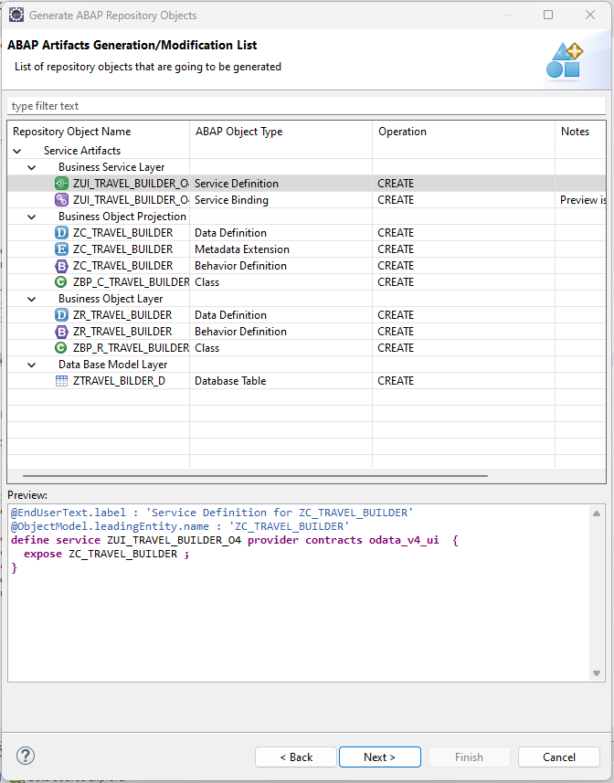

   v. Select a transport request from the list or browse for existing requests from under the “Enter a request number” and select the “CEI Workshop" request. You can also create a new request.

   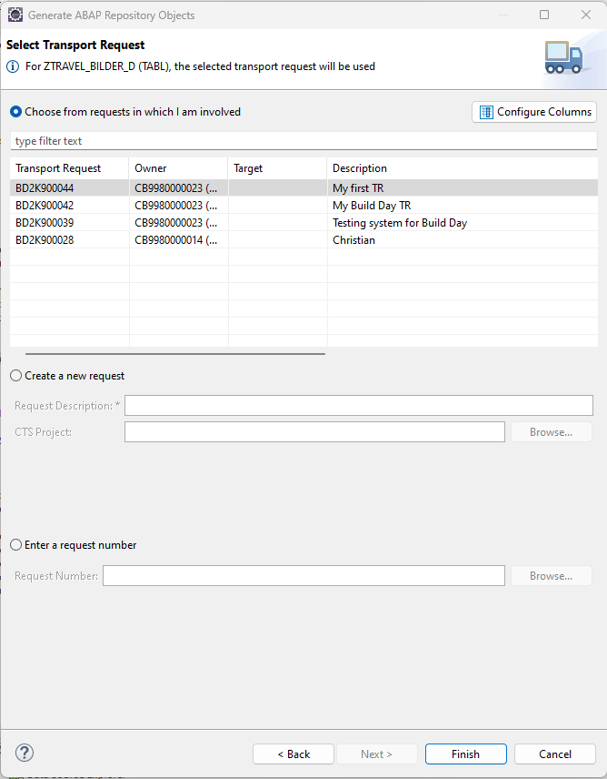

   vi. Click Finish and wait for artifacts to generate.

   vii. Publish the artifacts.

   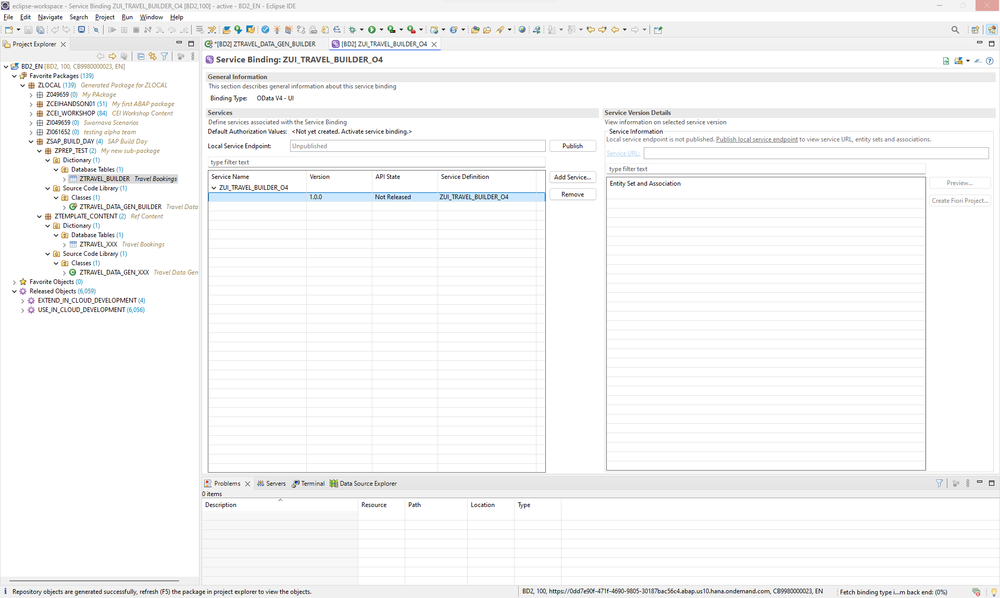

   viii. Preview the Fiori Application.

2. **Create a Fiori Project:** Link Business Application Studio to your project

   i. Create a Fiori dev space for yourself [here](https://spa-us10-nwjsondh.us10cf.applicationstudio.cloud.sap/index.html?externalRedirect=true).

   

   ii. You would need the dev space id of the newly created dev space to complete the next steps.

   

   iii. Go back to eclipse and open project properties.

   

   iv. Use the below details and link the dev space under “ABAP Development Tools” -> “External IDE Configuration” -> “Configure External IDE” -> “SAP Business Application Studio”

   - URL: <https://spa-us10-nwjsondh.us10cf.applicationstudio.cloud.sap/index.html>
   - Dev Space Id: `<dev space id from previous step>`
   - Destination Name: `BD2`

   v. Click on Apply and Close.

   vi. Select the newly published entity and select Create Fiori Project.

   

   vii. Select the “List Report Page” as the template.

   

   viii. Review the Entity Selection step and press Next.

   ix. Review the project attributes and press Finish. This will generate a Fiori Application. Please wait for the files to be load.

   x. Click on Preview application and select start-mock. This will setup the dependencies and start a mock application.

   

   

   xi. In the preview app press Go to view mock data.

   

## Key Takeaways

- SAP Build simplifies ABAP extensibility.
- Integration allows seamless development across SAP BTP and S/4HANA.
- Service bindings can be reused across multiple SAP Build tools, enhancing collaboration and flexibility.

## Troubleshooting

### Common Issues

| Issue                        | Possible Solution                                         |
| ---------------------------- | --------------------------------------------------------- |
| Destination not reachable    | Verify URL and authentication settings.                   |
| Transport request not listed | Check ABAP system connection and permissions.             |
| Service binding not found    | Ensure the package is created in the correct ABAP system. |

## Appendix

### References

- SAP Build Documentation
- SAP BTP ABAP Environment Guide

### Glossary

- BTP: Business Technology Platform.
- ADT: ABAP Development Tools.

### Contact Information

For assistance during the session, reach out to:
Swarnava Chatterjee (<swarnava.chatterjee@sap.com>) (Product Manager, SAP Build)
